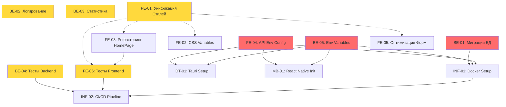

# Карта Задач Web Titles Tracker

> **Полный план развития проекта с зависимостями между задачами**

## 📊 Общая Статистика

- **Всего задач**: 15
  - **Backend**: 5 задач
  - **Frontend**: 6 задач (5 существующих + 1 новая)
  - **Desktop**: 1 задача
  - **Mobile**: 1 задача  
  - **Infrastructure**: 2 задачи

---

## 🎯 Критичность Задач

### 🔴 Критичные (MUST HAVE для MVP)
- BE-01: Настройка миграций базы данных
- BE-05: Вынос секретов в переменные окружения
- FE-04: Вынос API URL в переменные окружения

### 🟡 Важные (Улучшают качество)
- BE-02: Реализация системы логирования
- BE-03: Реализация модуля статистики
- BE-04: Написание тестов для Backend
- FE-01: Унификация подхода к стилизации
- FE-06: Написание тестов для Frontend

### 🟢 Желательные (Расширяют функциональность)
- FE-02: Очистка и оптимизация CSS-переменных
- FE-03: Рефакторинг HomePage.tsx
- FE-05: Оптимизация работы с формами
- DT-01: Настройка и интеграция Tauri Desktop
- MB-01: Инициализация React Native проекта
- INF-01: Настройка Docker Containerization
- INF-02: Настройка CI/CD Pipeline

---

## 📋 Подробный План Задач

### Backend (5 задач)

#### BE-01: Настройка миграций базы данных
**Файл**: `docs/tasks/work/backend/01-database-migrations.md`  
**Зависимости**: Нет  
**Описание**: Отключить `synchronize: true` и настроить TypeORM миграции для production.  
**Критичность**: 🔴 Критичная

#### BE-02: Реализация системы логирования
**Файл**: `docs/tasks/work/backend/02-implement-logging.md`  
**Зависимости**: Нет  
**Описание**: Реализовать кастомный LoggerService для записи в файлы `/logs/YYYY-MM-DD.txt`.  
**Критичность**: 🟡 Важная

#### BE-03: Реализация модуля статистики
**Файл**: `docs/tasks/work/backend/03-implement-statistics.md`  
**Зависимости**: Нет  
**Описание**: Расширить ProfileService для вычисления статистики (любимые категории, жанры, время просмотра).  
**Критичность**: 🟡 Важная

#### BE-04: Написание Unit и Integration тестов
**Файл**: `docs/tasks/work/backend/04-write-tests.md`  
**Зависимости**: Нет (можно выполнять параллельно)  
**Описание**: Покрыть тестами все services и controllers (>= 80% coverage).  
**Критичность**: 🟡 Важная

#### BE-05: Вынос секретов в переменные окружения
**Файл**: `docs/tasks/work/backend/05-environment-variables.md`  
**Зависимости**: Нет  
**Описание**: Вынести JWT_SECRET и другие чувствительные данные в `.env`.  
**Критичность**: 🔴 Критичная

---

### Frontend (6 задач)

#### FE-01: Унификация подхода к стилизации
**Файл**: `docs/tasks/work/frontend/01-unify-styles.md`  
**Зависимости**: Нет  
**Описание**: Выбрать единый подход (TailwindCSS + shadcn/ui ИЛИ CSS-модули) и мигрировать весь код.  
**Критичность**: 🟡 Важная

#### FE-02: Очистка и оптимизация CSS-переменных
**Файл**: `docs/tasks/work/frontend/02-cleanup-css-variables.md`  
**Зависимости**: FE-01 (желательно)  
**Описание**: Привести CSS-переменные к единому стандарту, удалить дублирование.  
**Критичность**: 🟢 Желательная

#### FE-03: Рефакторинг HomePage.tsx
**Файл**: `docs/tasks/work/frontend/03-refactor-homepage.md`  
**Зависимости**: Нет  
**Описание**: Разбить монолитный компонент на кастомные хуки и подкомпоненты.  
**Критичность**: 🟢 Желательная

#### FE-04: Вынос API URL в переменные окружения  
**Файл**: `docs/tasks/work/frontend/04-env-api-config.md`  
**Зависимости**: Нет  
**Описание**: Вынести захардкоженный API URL в `.env` файлы.  
**Критичность**: 🔴 Критичная

#### FE-05: Оптимизация работы с формами
**Файл**: `docs/tasks/work/frontend/05-optimize-forms.md`  
**Зависимости**: FE-01 (желательно)  
**Описание**: Внедрить `react-hook-form` или создать оптимизированные обработчики форм.  
**Критичность**: 🟢 Желательная

#### FE-06: Написание тестов для Frontend
**Файл**: `docs/tasks/work/frontend/06-write-tests.md`  
**Зависимости**: FE-01 (желательно), FE-03 (желательно)  
**Описание**: Покрыть тестами store, hooks, компоненты и страницы (>= 70% coverage).  
**Критичность**: 🟡 Важная

---

### Desktop (1 задача)

#### DT-01: Настройка и интеграция Tauri Desktop
**Файл**: `docs/tasks/work/desktop/01-tauri-setup.md`  
**Зависимости**: FE-04, BE-05  
**Описание**: Настроить Tauri для корректной работы с frontend и backend, создать инсталлятор.  
**Критичность**: 🟢 Желательная

---

### Mobile (1 задача)

#### MB-01: Инициализация React Native проекта
**Файл**: `docs/tasks/work/mobile/01-react-native-init.md`  
**Зависимости**: FE-04, BE-05  
**Описание**: Создать React Native проект с navigation, API client, state management.  
**Критичность**: 🟢 Желательная

---

### Infrastructure (2 задачи)

#### INF-01: Настройка Docker Containerization
**Файл**: `docs/tasks/work/infrastructure/01-docker-setup.md`  
**Зависимости**: BE-01, BE-05, FE-04  
**Описание**: Создать Dockerfile для backend/frontend, настроить docker-compose.  
**Критичность**: 🟢 Желательная

#### INF-02: Настройка CI/CD Pipeline
**Файл**: `docs/tasks/work/infrastructure/02-ci-cd-pipeline.md`  
**Зависимости**: BE-04, FE-06, INF-01  
**Описание**: Настроить GitHub Actions для автоматического тестирования и деплоя.  
**Критичность**: 🟢 Желательная

---

## 🗺️ Граф Зависимостей



**Легенда:**
- 🔴 Красный: Критичные задачи (выполнить в первую очередь)
- 🟡 Жёлтый: Важные задачи (улучшают качество)
- 🟢 Зелёный: Желательные задачи (расширяют функциональность)
- `---` Сплошная стрелка: Жёсткая зависимость (MUST выполнить до)
- `-.->` Пунктирная стрелка: Желательная зависимость (лучше выполнить до)

---

## 📝 Рекомендуемый Порядок Выполнения

### Фаза 1: Критичные Задачи Backend/Frontend (Неделя 1)
1. ✅ **BE-05**: Вынос секретов в переменные окружения
2. ✅ **FE-04**: Вынос API URL в переменные окружения
3. ✅ **BE-01**: Настройка миграций базы данных

### Фаза 2: Качество и Стабильность (Неделя 2)
4. ✅ **BE-02**: Реализация системы логирования
5. ✅ **BE-03**: Реализация модуля статистики
6. ✅ **FE-01**: Унификация подхода к стилизации

### Фаза 3: Тестирование (Неделя 3)
7. ✅ **BE-04**: Написание тестов для Backend
8. ✅ **FE-06**: Написание тестов для Frontend

### Фаза 4: Оптимизация Frontend (Неделя 4)
9. ✅ **FE-02**: Очистка и оптимизация CSS-переменных
10. ✅ **FE-03**: Рефакторинг HomePage.tsx
11. ✅ **FE-05**: Оптимизация работы с формами

### Фаза 5: Расширение Платформ (Неделя 5-6)
12. ✅ **DT-01**: Настройка Tauri Desktop
13. ✅ **MB-01**: Инициализация React Native

### Фаза 6: DevOps (Неделя 7)
14. ✅ **INF-01**: Настройка Docker
15. ✅ **INF-02**: Настройка CI/CD

---

## ✅ Процесс Выполнения Задач

Для **каждой** задачи:

1. **Начало работы**:
   - Прочитать файл задачи полностью
   - Проверить, что все зависимости выполнены

2. **Выполнение**:
   - Следовать чек-листу задачи
   - Тщательно тестировать каждый этап
   - Отмечать выполненные пункты

3. **Проверка качества**:
   - Пройти все пункты из секции "Тестирование"
   - Запустить все проверки кода (ESLint, TypeScript, build)
   - Убедиться, что приложение работает стабильно

4. **Финальная проверка**:
   - Убедиться, что ВСЕ чек-боксы в задаче отмечены ✅
   - Провести полное тестирование
   - Провести самопроверку кода (code review)
   - Production build должен быть успешным

5. **Завершение**:
   - **ТОЛЬКО ПОСЛЕ** прохождения всех проверок
   - Перенести файл задачи в `docs/tasks/done/[category]/`
   - Обновить эту карту задач (отметить как выполненную)

---

## 📂 Структура Задач

```
docs/tasks/
├── work/                      # Текущие задачи в работе
│   ├── backend/               # 5 задач для backend
│   ├── frontend/              # 6 задач для frontend
│   ├── desktop/               # 1 задача для desktop
│   ├── mobile/                # 1 задача для mobile
│   └── infrastructure/        # 2 задачи для infrastructure
│
├── done/                      # Завершённые задачи
│   ├── backend/
│   ├── frontend/
│   ├── desktop/
│   ├── mobile/
│   └── infrastructure/
│
└── README.md                  # Эта карта задач
```

---

## 🎁 По Завершении Всех Задач

После выполнения всех 15 задач проект будет иметь:

✅ Полностью функциональный **Backend** (NestJS) с:
- Миграциями БД
- Системой логирования
- Модулем статистики
- Покрытием тестами >= 80%
- Безопасным хранением секретов

✅ Полностью функциональный **Frontend** (React + Vite) с:
- Единообразной стилизацией (shadcn/ui)
- Оптимизированными формами
- Покрытием тестами >= 70%
- Чистой архитектурой

✅ **Desktop приложение** (Tauri) с инсталлятором для Windows

✅ **Mobile приложение** (React Native) для iOS/Android

✅ **DevOps инфраструктуру**:
- Docker контейнеризацию
- CI/CD pipeline на GitHub Actions

---

## 📞 Контакты и Поддержка

**Автор**: Anton Indyukov  
**Проект**: Web Titles Tracker  
**Статус**: 🚧 В разработке

---

**Обновлено**: 13 января 2026  
**Версия документа**: 1.0
